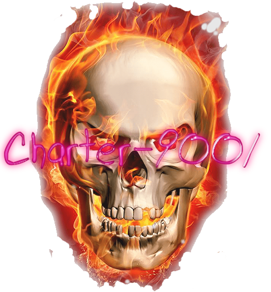
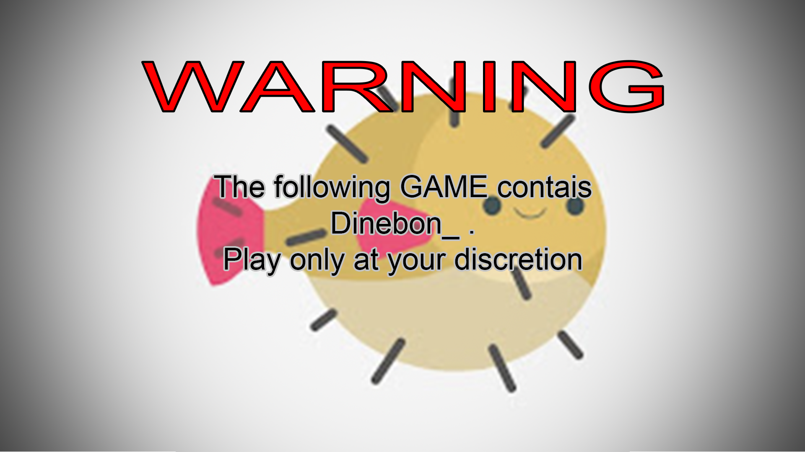

Charter-9001 is a tool for placing musical notes in songs for the game that called The Bass That Should Be Heard.

# Compilation:
If you want to compile this piece of code [download FMOD](https://www.fmod.com/download). And install it.
### Windows
When you install FMOD create new environment path called `FMOD_PATH` and put value off FMOD folder. For example: 

Then create `build` folder inside project open `cmd` there and do `cmake ..`
### Linux
idk i dont know if it's compile there. So you linux nerd can figure that out

## Credits:
* **Pyr0Guy** - i made this shit
* **myrick_77** - draw this fuck
* **dinebon_** - we dont talk about him :(

# Dinebon
This tool originally made for one person that i hate. Here is his photo:

Avoid this creature at any cost
